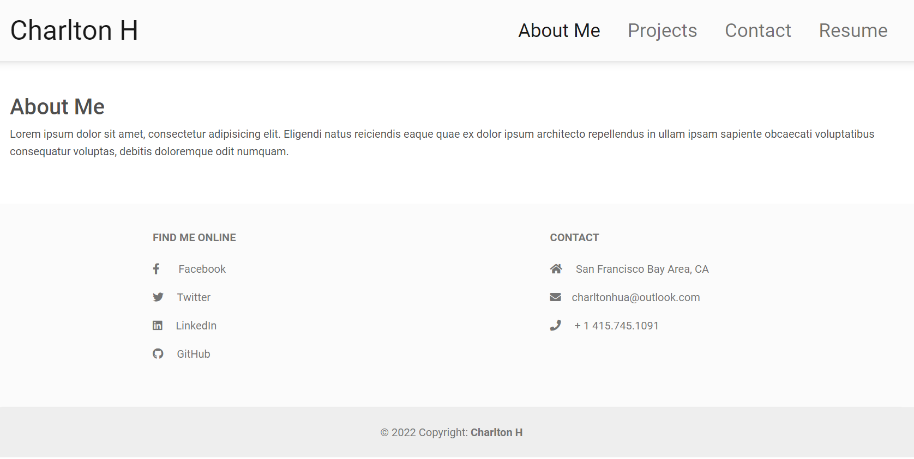

# CHARLTON-H REACT

## Description

The purpose of this project is to display user knowledge of react.

## Demo

[View Live Site Here](https://charlton-h.github.io/charlton-h-react/)

## Built With

   

## Table of Contents

- [Usage](#Usage)

## Usage

Currently, there is no usage function other than portfolio & code review.

### &copy; 2022 Charlton H
